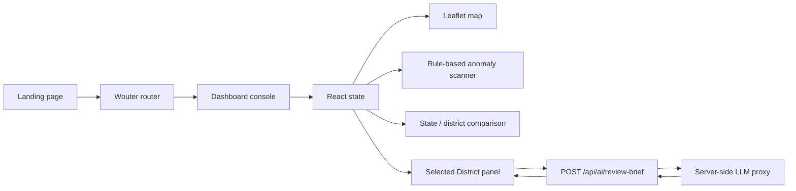

# VanAdhikar

### Field intelligence for Forest Rights Act implementation

> **Detect the pressure. Explain the signal. Act with confidence.**

VanAdhikar is an interactive monitoring console for exploring synthetic Forest Rights Act (FRA) implementation signals at national, state, and district level. It combines a map-first working surface, explainable rule-based anomaly leads, contextual comparisons, and a bounded AI review assistant that helps a human officer decide where verification should begin.

The project is designed as a transparent prototype for a hackathon setting. It does not make legal determinations, does not expose claimant personally identifiable information, and does not treat an anomaly as proof of wrongdoing.

[Open the live application](https://3000-i9spfr0khb0r39yzvtpdk-6423a114.sg2.manus.computer)

---

## Why VanAdhikar exists

FRA implementation teams often need to move between three different questions:

1. **Where is pressure accumulating?**
2. **Why is a record being surfaced for review?**
3. **What should a human check next?**

VanAdhikar brings those questions into one working surface. The homepage establishes the product story and map context. The console then lets a user move from India-wide signals to a selected state, district, marker, anomaly lead, or comparison row without losing context.

> The prototype boundary is deliberate: district-level records are synthetic and intended for demonstration only. Definitions and reporting vocabulary are anchored to public Ministry of Tribal Affairs and data.gov.in references.[1] [2]

---

## Product experience

| Workspace | What it provides | Why it matters |
|---|---|---|
| **Overview** | National KPIs, implementation pulse, and guided workflow | Establishes the scale and current pressure before investigation |
| **Claims map** | Interactive Leaflet map with claim dots, backlog rings, anomaly emphasis, search, state focus, and district selection | Connects operational signals to geography |
| **Anomalies** | Explainable review leads with risk level, reason, and confidence | Keeps the review path transparent instead of presenting a black-box verdict |
| **State / district comparison** | India-wide state comparison or selected-state district comparison | Lets users identify outliers within the current scope |
| **AI review assistant** | Server-side generated brief containing signal, why it matters, and next human check | Adds AI value while preserving synthetic-data and human-review safeguards |

### A focused interaction model

The console follows a simple operating loop:

```text
Select a scope → locate a signal → inspect the rule → choose the next human check
```

The interface keeps the selected state and district synchronized across the map, search label, comparison scope, selected-district panel, KPIs, review queue, and AI review card.

---

## Highlights

### Map-first investigation

The claims map is built with **Leaflet** and **React Leaflet**. Users can pan, zoom, search for a state or district, toggle map layers, select a marker, and open a marker popup. Selecting a marker updates the Selected District panel and focuses the map on the selected record.

The map supports three visual layers:

- **Claim locations** shown as red, amber, or green dots based on review risk.
- **Pending backlog rings** sized from pending workload.
- **Anomaly emphasis** that increases marker prominence for higher-risk records.

### Context-aware comparison

The comparison section changes meaning according to the selected scope:

- **India** shows one row per state.
- **A selected state** shows one row per district within that state.

Both views support sorting by approval rate, pending backlog, and anomaly count.

### Explainable signals

The deterministic anomaly scanner evaluates synthetic FRA records using explicit rules such as pending duration, land-record conflict, area mismatch, and approval movement. Each surfaced record includes a plain-language reason. These rules are intended to create a review lead, not a conclusion.

### Bounded AI assistance

The AI review assistant receives only the selected synthetic district record and asks the model to return three practical sections:

1. **SIGNAL** — what the supplied record indicates.
2. **WHY IT MATTERS** — why the pattern deserves attention.
3. **NEXT HUMAN CHECK** — what a field officer or program lead should verify.

The request is made server-side so credentials do not reach the browser. The system prompt explicitly instructs the model not to invent evidence, legal conclusions, or claimant details.

### Branded motion system

VanAdhikar uses a forest-intelligence visual language throughout the product:

- Logo-based route transition with a tree silhouette and orbiting leaf motion.
- Immediate emblem preload so the transition mark appears without a delayed image fetch.
- Homepage parallax movement, map depth, scroll progress, and staggered content reveals.
- Site-wide dashboard section reveals and panel lift states.
- Scroll-aware workspace navigation that highlights the section nearest the viewport focus line.
- Mobile and `prefers-reduced-motion` fallbacks.

---

## Architecture



### Runtime layers

| Layer | Implementation | Responsibility |
|---|---|---|
| Client shell | React 19, TypeScript, Vite | Application bootstrapping, routing, theme, transitions |
| Navigation | Wouter | `/` landing route, `/dashboard` console route, hash-based workspace sections |
| UI system | Custom CSS tokens, Radix primitives, Lucide icons | Accessible controls, responsive layout, visual system |
| Geographic view | Leaflet, React Leaflet | Tiles, map controls, marker layers, popups, focus behavior |
| Analytics view | Recharts | Claims-versus-titles movement chart |
| Synthetic data | `client/src/lib/fraClaims.ts` and dashboard constants | Demo records, geographic features, rule inputs, state focus data |
| Server | Express and Node HTTP server | Static serving, client fallback routing, AI review endpoint |
| AI integration | Server-side `/api/ai/review-brief` | Constrained review brief generation with synthetic-record disclosure |

### Important source locations

```text
client/
  index.html                         Document shell, favicon, logo preload
  src/
    App.tsx                          Routes, theme provider, route transition, site motion
    pages/Landing.tsx                Public homepage and homepage-only scroll scene
    pages/Home.tsx                   Working console and dashboard interactions
    components/Map.tsx               Leaflet map wrapper and marker rendering
    components/BrandLoader.tsx       VanAdhikar logo-based loading animation
    contexts/ThemeContext.tsx        Persisted light/dark theme state
    lib/fraClaims.ts                 Synthetic claim data and explainable anomaly rules
    index.css                        Design tokens, responsive layout, motion, dark mode
server/
  index.ts                           Express server and AI review endpoint
shared/
  const.ts                           Shared application constants
```

---

## Technology stack

| Category | Technologies |
|---|---|
| Frontend | React 19, TypeScript, Vite 7 |
| Routing | Wouter |
| Styling | Tailwind CSS 4, custom CSS variables, `tw-animate-css` |
| Components | Radix UI primitives, Lucide React |
| Maps | Leaflet 1.9, React Leaflet 5, OpenStreetMap tiles |
| Charts | Recharts |
| Server | Express 4, Node.js |
| AI | Server-side built-in LLM proxy using `gpt-5-mini` |
| Package manager | pnpm |
| License | MIT |

---

## Getting started

### Prerequisites

Install the following before starting development:

- Node.js with an active ESM-compatible runtime.
- pnpm 10 or a compatible pnpm version.
- Network access for map tiles and the configured server-side AI proxy when using AI review generation.

### Installation

```bash
git clone <repository-url>
cd vanadhikar
pnpm install --frozen-lockfile
```

### Development server

```bash
pnpm dev
```

The Vite server runs on port `3000` by default.

### Type checking

```bash
pnpm check
```

### Production build

```bash
pnpm build
```

This creates the Vite client build and bundles the Express server into `dist/index.js`.

### Production start

```bash
pnpm start
```

The server uses `PORT` when provided and otherwise listens on port `3000`.

### Formatting

```bash
pnpm format
```

---

## Demonstration flow

For a short live walkthrough, use the following sequence:

1. Start on the landing page and point out the national map surface and the synthetic-data boundary.
2. Enter the workspace through **Enter the workspace**.
3. Begin in **Overview** and establish the national implementation pulse.
4. Open **Claims map**, select a state, and show that the comparison panel changes from State comparison to District comparison.
5. Click a district marker and show the Selected District panel updating with the clicked record.
6. Open **Anomalies** and select a review lead with an explicit reason.
7. Use **Generate AI review** and explain that the assistant produces guidance from the supplied synthetic record rather than making a verdict.
8. Finish in **State comparison** or **District comparison** and show sorting by backlog, approval, or signals.

The strongest product narrative is:

> **Find the bottleneck. Understand the reason. Decide where human verification starts.**

---

## Data and AI safety boundaries

VanAdhikar is a prototype and should not be used as a production eligibility, entitlement, legal, enforcement, or claimant-risk system without substantial validation and governance.

| Boundary | Current behavior |
|---|---|
| Record provenance | District-level records are synthetic demonstration data |
| Personal data | No claimant PII is included in the prototype dataset |
| Rule interpretation | Rules surface leads for review; they do not establish wrongdoing |
| AI output | AI uses supplied record fields and is instructed not to invent evidence |
| Human decision-making | Every result is framed as a prompt for human verification |
| External data | Map tiles and reference links depend on external services |
| Production readiness | Authentication, audit logging, data governance, monitoring, and formal evaluation are not included |

---

## Configuration notes

The AI endpoint expects the built-in proxy environment variables used by the runtime:

- `BUILT_IN_FORGE_API_URL`
- `BUILT_IN_FORGE_API_KEY`

If the proxy is unavailable, the endpoint returns a controlled error and the client displays an explanatory toast rather than treating an HTML or proxy response as a valid JSON brief.

The application does not send AI credentials to the browser. The browser sends the selected synthetic record to the server endpoint, and the server performs the model request.

---

## Current limitations

The project intentionally prioritizes a polished, explainable demonstration over production completeness. The current version does not include persistent user accounts, role-based access control, a production database, real government case records, server-side map tile proxying, formal model evaluation, or an audit trail for AI-generated briefs.

The visual dashboard data is representative rather than statistically validated. Map markers for some states are derived from the local synthetic district records because the prototype geographic feature set is intentionally bounded.

---

## Roadmap

| Priority | Next improvement | Expected value |
|---|---|---|
| High | Connect to governed, versioned district data with provenance metadata | Makes the console operationally credible |
| High | Add authentication, roles, and audit history | Supports responsible multi-user deployment |
| High | Add AI evaluation fixtures and human rating capture | Measures usefulness and hallucination resistance |
| Medium | Add time-series filters and exportable review packets | Extends the console from exploration to action |
| Medium | Add district boundary polygons and richer map legends | Improves geographic precision |
| Medium | Add an accessibility audit and keyboard-first map workflow | Improves inclusive usability |
| Low | Add offline demo mode and bundled tile snapshots | Makes live presentations resilient to network issues |

---

## Contributing

Contributions should preserve the project’s central distinction between **evidence**, **rule-based review leads**, and **AI-generated guidance**. New features should state what data they use, what they infer, and where human verification remains necessary.

Before opening a change, run:

```bash
pnpm check
pnpm build
```

For UI changes, also verify the homepage, dashboard, dark mode, mobile layout, route transition, and reduced-motion behavior.

---

## License

This project is licensed under the MIT License. See the project license file for the complete terms.

---

## References

[1]: https://tribal.nic.in/fra.aspx "Ministry of Tribal Affairs — Forest Rights Act"
[2]: https://www.data.gov.in/ "Open Government Data Platform India — data.gov.in"
[3]: https://leafletjs.com/ "Leaflet JavaScript library documentation"
[4]: https://react-leaflet.js.org/ "React Leaflet documentation"
[5]: https://vite.dev/ "Vite documentation"
[6]: https://react.dev/ "React documentation"
